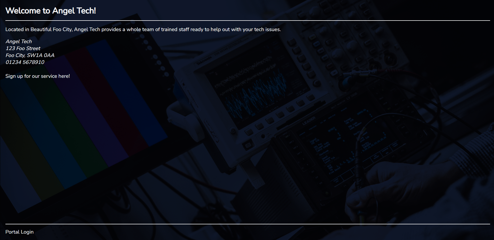
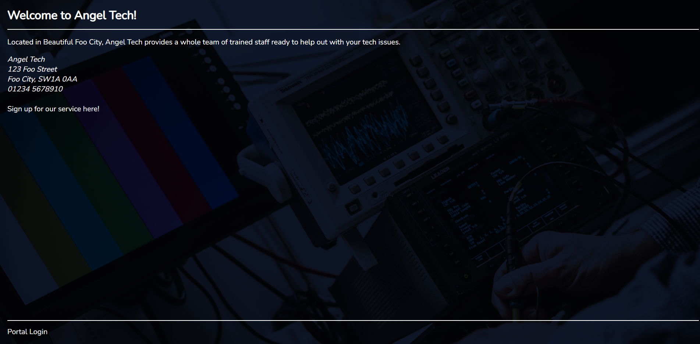
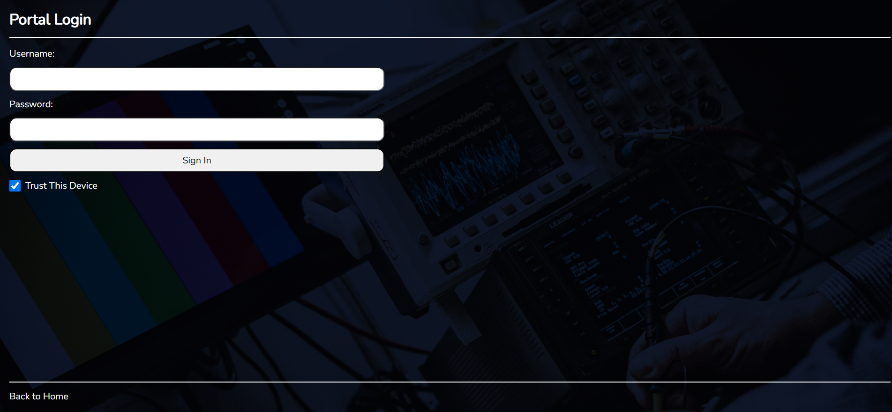
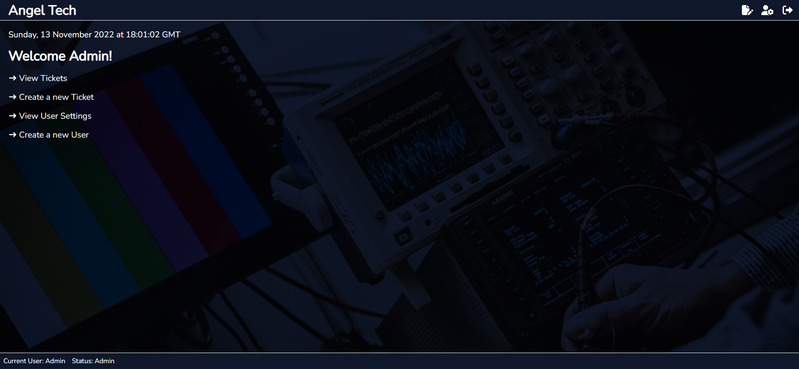
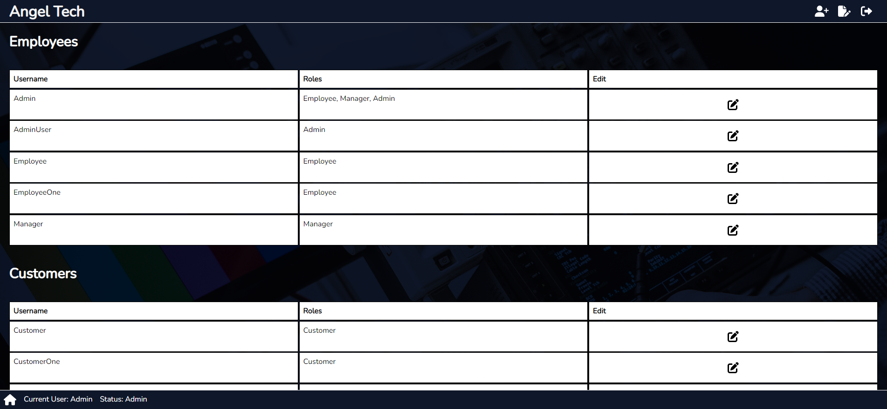
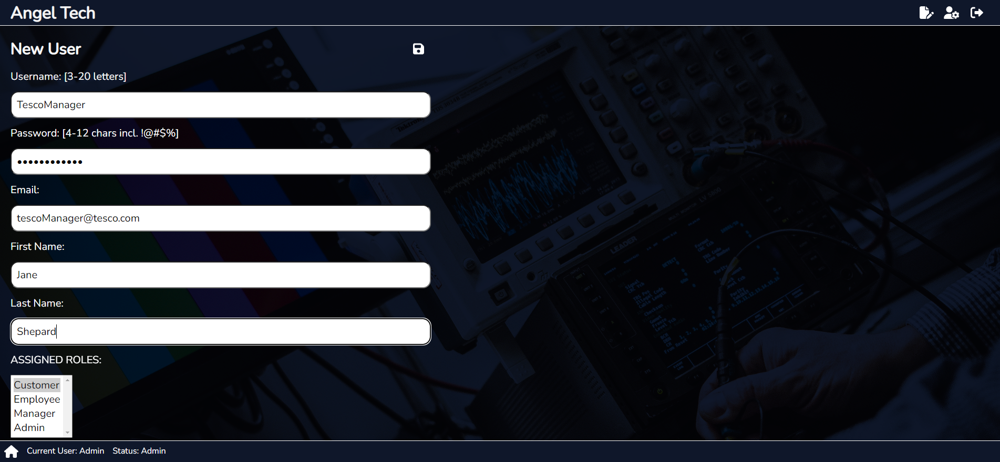
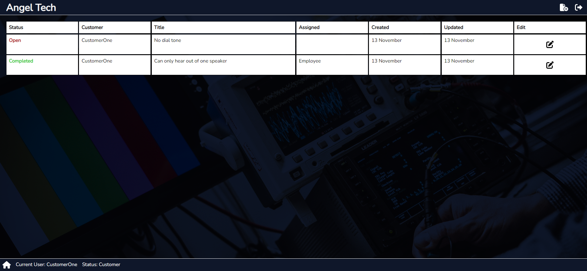
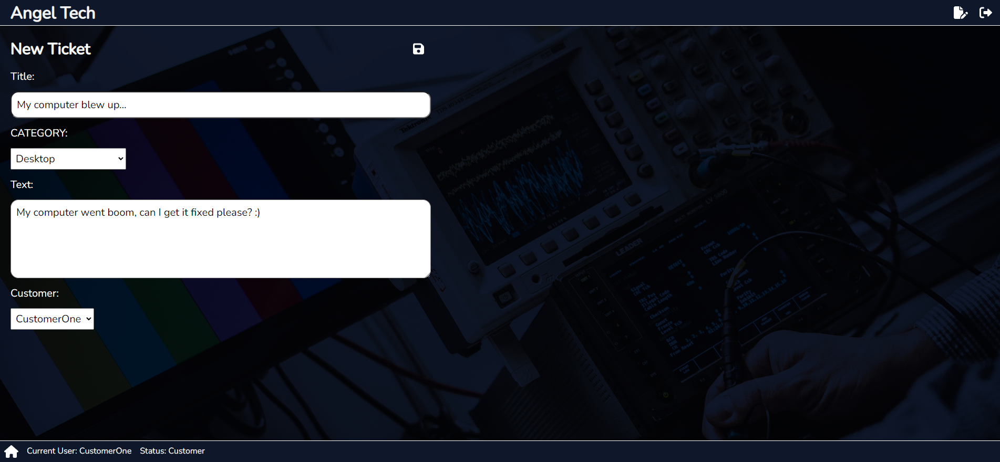

# Angel Tech Helpdesk MERN Project <!-- omit in toc -->

## Table of Contents <!-- omit in toc -->

- [Description](#description)
- [Technologies](#technologies)
- [Linked Repositories](#linked-repositories)
- [Packages](#packages)
- [Roadmap](#roadmap)
- [Demo](#demo)
- [Screenshots](#screenshots)

## Description

A helpdesk application that allows users to login to an account, create tickets for technical issues, update tickets and admin users can create, delete and manage other user accounts. Client-side created using React. Server-side created using MongoDB for databse, Express.js and Node.js for API.

## Technologies

## Linked Repositories

- Frontend:
  [AngelTech Frontend](https://github.com/HaylzRandom/angeltech-frontend)
- Backend: [AngelTech API](https://github.com/HaylzRandom/angeltech-api)

## Packages

<table>
    <tr><th>Name</th><th>Description</th></tr>
    <tr><td>@fortawesome</td><td>Fontawesome packages for React to enable use as components in React apps.</td></tr>
    <tr><td>@fvilers/disable-react-devtools</td><td>A simple method to disable the React Developer Tools addon to access your application.</td></tr>
    <tr><td>@reduxjs/toolkit</td><td>Used for state management to manage the state of users and tickets.</td></tr>
    <tr><td>jwt-decode</td><td>Small browser library that helps decode JWTs token which are Base64Url encoded.</td></tr>
    <tr><td>react</td><td>JavaScript library for building user interfaces</td></tr>
    <tr><td>react-dom</td><td>Package that provides DOM-specific methods for React.</td></tr>
    <tr><td>react-redux</td><td>Used for state management to manage the state users and allowing persistant login to occur throughout use of the applications.</td></tr>
    <tr><td>react-router-dom</td><td>Enables client side routing navigation.</td></tr>
    <tr><td>react-spinners</td><td>Package containing a collection of React spinners that are used for loading data.</td></tr>
</table>

## Roadmap

- [x] When deleting a user, checked if there are any open tickets attached to
      them
- [x] Redirect user if they should have have access to ticket
- [ ] Redirect user if they should have have access to profile
- [ ] When creating a customer user, add a company to their account
- [ ] Research if a cleaner method for pre-populating customer exists when
      creating ticket
- [x] Set last logged in date and time on user dashboard
- [x] Create a custom loading spinner
- [ ] Redesign website layout with new styles
- [ ] Add a note system to tickets
- [ ] Allow users to alter their own passwords (Only Admins and Managers can
      alter passwords)
- [ ] When tickets are updated, send an e-mail out
- [ ] Implement TypeScript when more comfortable with it

## Demo

[Demo Website](https://angeltech-helpdesk.onrender.com/)

Demo Gif

## Screenshots

    <table>
        <thead>General</thead>
        <tr>
            <td>
                
            </td>
            <td>
                
            </td>
        </tr>
    </table>

    <table>
        <thead>Admin Pages</thead>
        <tr>
            <td>
                
            </td>
            <td>
                
            </td>
        </tr>
        <tr>
            <td>
                
            </td>
        </tr>
    </table>

    <table>
        <thead>Customer Pages</thead>
        <tr>
            <td>
                
            </td>
            <td>
                
            </td>
        </tr>
    </table>

